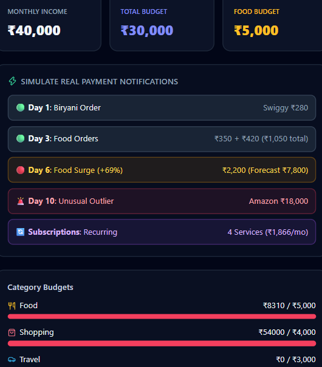
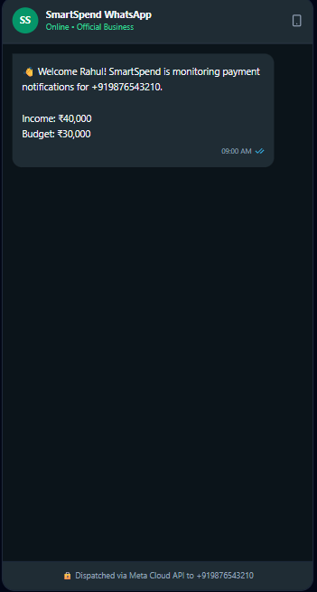
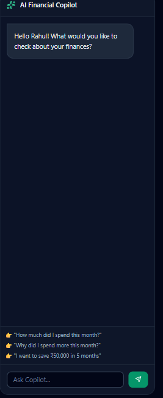

⚡ SmartSpend AI — Autonomous Spending Intelligence Engine
Java 17 Spring Boot 3.4.1 PostgreSQL 16 React 18 Tailwind CSS 3 License: MIT
An event-driven personal financial intelligence platform built with Java 17 and
Spring Boot 3. It intercepts mobile payment notifications (UPI, SMS,
NetBanking), parses noisy transaction text, performs statistical anomaly
detection extrapolates predictive monthly burn-rates, flags
recurring subscriptions, and powers an interactive AI Financial Copilot.

📑 Table of Contents

1.  Executive Overview
2.  System Architecture
3.  Deep-Dive: Core Java & Spring Engineering
4.  Mathematical & Statistical Models
5.  Database Architecture & Schema
6.  API Specification & Ingestion Contract
7.  The 10-Day Rahul Simulation Lifecycle
8.  Step-by-Step Setup & How to Run
9.  Automated Testing & Verification
10. Troubleshooting Guide
11. Tech Stack Inventory

💡 Executive Overview

Most budgeting applications suffer from Notification Fatigue and Hindsight Bias:
they either notify the user for every ₹10 purchase (causing them to ignore
alerts) or inform them that their budget has been exceeded after the month has
already ended.

SmartSpend AI solves this by introducing Autonomous Financial Intelligence:

  - Smart Alert Throttling: Instead of nagging after every purchase, it
    aggregates velocity and dispatches periodic summaries (e.g., weekly food
    velocity updates).
  - Predictive Run-rate Forecasting: Calculates linear trajectory mid-month,
    warning the user before they run out of money (e.g., predicting ₹7,800
    month-end food spend against a ₹5,000 budget by Day 6).
  - Statistical Anomaly Flagging: Avoids rigid rules by using Gaussian
    Distribution (Z-score) over historical user patterns to flag true
    statistical outliers (e.g., a ₹18,000 Amazon charge against an average
    ticket of ₹800).
  - Zero-Latency Ingestion Pipeline: Decoupled ingestion with Server-Sent Events
    (SSE) ensures sub-second updates across web sessions.

🏛️ System Architecture

[ Android Client / Payment App Notification ]
  - Google Pay, PhonePe, Paytm, Bank SMS
  - Encrypted POST { "phoneNumber": "+919876543210", "rawText": "..." }
                        │
                        ▼
┌────────────────────────────────────────────────────────────────────────┐
│                       SPRING BOOT 3.4.1 CORE                          │
│                                                                        │
│  ┌─────────────────────────┐         ┌──────────────────────────────┐  │
│  │ TransactionParserService│ ──────► │ IntelligenceEngineService    │  │
│  │ - Resilient Regex       │         │ - Z-Score Anomaly Detector   │  │
│  │ - Merchant Dictionary   │         │ - Burn-rate Month Forecaster │  │
│  │ - Unicode Normalization │         │ - Subscriptions Detector     │  │
│  └─────────────────────────┘         └──────────────┬───────────────┘  │
│                                                     │                  │
│       ┌─────────────────────────────────────────────┴──────────┐       │
│       ▼                                                        ▼       │
│  ┌───────────────────────────┐                    ┌─────────────────┐  │
│  │ Spring Data JPA Repository│                    │ WhatsApp Gateway│  │
│  │ - Native Variance SQL     │                    │ - Cloud API     │  │
│  │ - HikariCP Connection Pool│                    │ - Outbound Msg  │  │
│  └─────────────┬─────────────┘                    └─────────────────┘  │
└────────────────┼───────────────────────────────────────────────────────┘
                 │                                   │
      (PostgreSQL 16 Storage)            (Server-Sent Events / SSE)
                 ▼                                   ▼
        ┌─────────────────┐             ┌─────────────────────────┐
        │  PostgreSQL 16  │             │   React + Tailwind UI   │
        │  - users        │             │   - Live Ingestion Feed │
        │  - budgets      │             │   - WhatsApp Simulator  │
        │  - transactions │             │   - Dynamic Gauges      │
        │  - goals        │             │   - AI Copilot Terminal │
        └─────────────────┘             └─────────────────────────┘

🛠️ Deep-Dive: Core Java & Spring Engineering

1. High-Throughput Event Streaming via Server-Sent Events (SSE)

Rather than client-side polling, the backend uses SseEmitter managed inside a
thread-safe CopyOnWriteArrayList<SseEmitter>. When a transaction is committed to
PostgreSQL, the event payload is dispatched to all connected clients over a
persistent HTTP connection.

2. Native Database Statistical Aggregations

To prevent memory bloat, statistical variance and historical deviations are
executed natively inside PostgreSQL via HikariCP rather than in the JVM:

@Query(value = """
    SELECT AVG(amount) as mean, COALESCE(STDDEV(amount), 0) as stddev
    FROM transactions
    WHERE user_id = :userId AND LOWER(category) = LOWER(:category)
""", nativeQuery = true)
CategoryStats getCategoryStatistics(@Param("userId") UUID userId, @Param("category") String category);

3. Multi-Stage Resilient Ingestion Parser

Payment notification texts vary wildly across banks (e.g., ₹280 debited,
Rs. 280.00 spent, INR 280 transferred). The parser executes a fallback strategy:

1.  Extract currency magnitude using a greedy decimal regex that tolerates
    Windows ANSI encoding mangling (₹, ?, Rs, INR).
2.  Exact token matching against known merchant categories (Swiggy \rightarrow
    Food, Uber \rightarrow Travel, Amazon \rightarrow Shopping).
3.  Fallback to contextual POS prepositions (to <Merchant>, at <Merchant>, for
    <Merchant>).

4. Agentic AI Integration with Tool Calling (Spring AI)

The conversational copilot uses the spring-ai-openai module configured with
declarative functional tools. When a user asks "Why did I spend more this
month?", the LLM invokes the @Bean tool getCategorySpending, retrieves dynamic
PostgreSQL aggregations, and synthesizes a natural response.

📐 Mathematical & Statistical Models

1. Z-Score Anomaly Detection

To identify abnormal spending, the engine runs a standard normal deviation
calculation against historical category parameters:

\mu = \frac{1}{N}\sum_{i=1}^{N} x_i \quad\text{(Historical Mean)}

\sigma = \sqrt{\frac{1}{N}\sum_{i=1}^{N} (x_i - \mu)^2} \quad\text{(Standard Deviation)}

\text{Z-Score} = \frac{X_{\text{current}} - \mu}{\sigma}

  - Evaluation Rule:
      - If \sigma > 50 and \text{Z-Score} \ge 3.0 (99.7\% confidence bound), the
        transaction is flagged as ANOMALY.
      - If variance is low (\sigma \le 50), transactions exceeding
        3.5 \times \mu trigger an outlier alert.

2. Linear Burn-Rate Month-End Projection

To warn users before their budget runs out, the engine computes an empirical
extrapolation over elapsed days in the active billing cycle:

\text{Daily Burn Rate} = \frac{\text{Spending MTD}}{\text{Day of Month}}

\text{Projected Spend} = \text{Daily Burn Rate} \times \text{Total Days in Month}

\text{Deficit} = \text{Projected Spend} - \text{Budget}_{\text{allocated}}

🗄️ Database Architecture & Schema

-- 1. Users Table (Core identity & global caps)
CREATE TABLE users (
    id UUID PRIMARY KEY DEFAULT gen_random_uuid(),
    name VARCHAR(100) NOT NULL,
    phone_number VARCHAR(20) UNIQUE NOT NULL,
    monthly_income NUMERIC(12, 2) NOT NULL,
    overall_monthly_budget NUMERIC(12, 2) NOT NULL
);

-- 2. Category Budgets Table (Granular caps)
CREATE TABLE category_budgets (
    id UUID PRIMARY KEY DEFAULT gen_random_uuid(),
    user_id UUID NOT NULL REFERENCES users(id) ON DELETE CASCADE,
    category VARCHAR(50) NOT NULL,
    allocated_amount NUMERIC(12, 2) NOT NULL,
    CONSTRAINT uq_user_category UNIQUE (user_id, category)
);

-- 3. Transactions Table (Event logs)
CREATE TABLE transactions (
    id UUID PRIMARY KEY DEFAULT gen_random_uuid(),
    user_id UUID NOT NULL REFERENCES users(id) ON DELETE CASCADE,
    amount NUMERIC(12, 2) NOT NULL,
    merchant VARCHAR(100) NOT NULL,
    category VARCHAR(50) NOT NULL,
    raw_payload TEXT,
    timestamp TIMESTAMP WITH TIME ZONE NOT NULL,
    is_recurring BOOLEAN DEFAULT FALSE
);

-- 4. Savings Goals Table (Long term wealth targets)
CREATE TABLE savings_goals (
    id UUID PRIMARY KEY DEFAULT gen_random_uuid(),
    user_id UUID NOT NULL REFERENCES users(id) ON DELETE CASCADE,
    target_amount NUMERIC(12, 2) NOT NULL,
    duration_months INT NOT NULL,
    monthly_saving_target NUMERIC(12, 2) NOT NULL,
    start_date DATE NOT NULL,
    is_active BOOLEAN DEFAULT TRUE
);

-- Optimized Index for Rolling Window Analytics
CREATE INDEX idx_tx_user_cat_time ON transactions(user_id, category, timestamp);

🔌 API Specification & Ingestion Contract

1. Ingest Payment Notification

  - Endpoint: POST /api/v1/transactions/ingest
  - Request Body:

{
  "phoneNumber": "+919876543210",
  "rawText": "₹280 debited. Payment to Swiggy successful."
}

  - Response Body (200 OK):

{
  "status": "RECORDED",
  "transaction": {
    "id": "44ed4cee-7321-4d06-95f0-eb9ff7a3556f",
    "amount": 280.00,
    "merchant": "Swiggy",
    "category": "Food",
    "timestamp": "2026-09-22T14:35:10.842+05:30",
    "recurring": false
  },
  "dispatchedWhatsAppMessages": [
    "💰 *Expense Recorded*\n\n₹280 spent on Food — Swiggy.\n\nFood budget: ₹280 / ₹5,000"
  ]
}

2. Fetch Dashboard Telemetry

  - Endpoint: GET /api/v1/dashboard?phoneNumber=+919876543210
  - Response: Returns aggregated MTD spend, category consumption, active
    subscriptions, and recent transactions.

3. Real-Time Server-Sent Events (SSE) Stream

  - Endpoint: GET /api/v1/stream
  - Headers: Accept: text/event-stream
  - Event Dispatched: TRANSACTION_SAVED (Streams newly parsed transactions and
    alert payloads live to open web tabs).

4. Financial Copilot Conversational Chat

  - Endpoint: POST /api/v1/ai/chat
  - Request Body:

{
  "message": "Why did I spend more this month?"
}

🚦 The 10-Day Rahul Simulation Lifecycle

| Phase             | Event / Input                                                 | System Intelligence Action                                                              | Dispatched WhatsApp Notification                                                                                                                                  |
| :---------------- | :------------------------------------------------------------ | :-------------------------------------------------------------------------------------- | :---------------------------------------------------------------------------------------------------------------------------------------------------------------- |
| **Day 1**         | ₹280 at Swiggy                                                | Classifies as `Food`. Records transaction and initializes rolling weekly aggregate.     | 💰 **Expense Recorded** ₹280 spent on Food — Swiggy. Food budget: ₹280 / ₹5,000                                                                              |
| **Day 3**         | ₹350 (Swiggy) + ₹420 (Zomato)                                 | Aggregates weekly spending to ₹1,050. Determines pacing is within weekly cap (₹1,250).  | 📊 **Spending Update** You've spent ₹1,050 on food this week. Weekly food budget is ₹1,250. **₹200 remaining.**                                           |
| **Day 6**         | ₹450 + ₹380 + ₹320 (Swiggy & Zomato)                          | Total hits ₹2,200 (+69% above normal ₹1,300). Calculates projected month-end burn rate. | ⚠️ **Food Spending Alert** You've spent ₹2,200 on food this week. 📈 **Spending Forecast** Projected monthly food spend: **₹7,800** (₹2,800 over budget). |
| **Subscriptions** | Netflix (₹649), Spotify (₹119), Prime (₹299), Internet (₹799) | Identifies recurring monthly cadence. Groups into a single monthly overhead metric.     | 🔄 **Recurring Expenses Detected** You have \~₹1,866/month in recurring payments. Netflix, Spotify, Prime, Internet.                                         |
| **Day 10**        | ₹18,000 at Amazon                                             | Statistical Outlier ($Z \ge 3.0$). Evaluates against shopping mean (₹800).              | 🚨 **Unusual Transaction** ₹18,000 spent at Amazon. Significantly higher than typical shopping transactions.                                                 |
| **AI Copilot**    | *"Why did I spend more this month?"*                          | Analyzes category differentials and flags online dining as the primary driver.          | *"Your spending increased mainly because Food increased by ₹1,900 from online food orders."*                                                                      |

🚀 Step-by-Step Setup & How to Run

Prerequisites

  - Java Development Kit (JDK): Version 17 LTS
  - Node.js: Version 18+ and npm
  - PostgreSQL Database Server: Port 5432
  - Apache Maven: Version 3.9+ (or use the included wrapper)

Step 1: Database Setup

1.  Open your PostgreSQL terminal (psql) or pgAdmin.
2.  Create the target database:

CREATE DATABASE smartspend_db;

Step 2: Configure Backend Credentials

Open backend/src/main/resources/application.yml and ensure your database
password is set:

server:
  port: 8080

spring:
  datasource:
    url: jdbc:postgresql://localhost:5432/smartspend_db
    username: postgres
    password: YOUR_POSTGRES_PASSWORD_HERE
    driver-class-name: org.postgresql.Driver

Step 3: Run the Spring Boot Backend

Open a PowerShell terminal, navigate to the backend directory, and start the
service:

cd backend
mvn clean spring-boot:run

Look for these confirmation logs:

>>> SEED SUCCESS: Rahul created with ID: 05aaeac6-5835-4b63-ba7c-10cb0ceaeab5
>>> Budgets: Food ₹5,000 | Shopping ₹4,000 | Travel ₹3,000
Tomcat started on port 8080 (http) with context path '/'
Started BackendApplication in X.XXX seconds

Step 4: Run the React Dashboard

Open a second PowerShell terminal, navigate to the frontend directory, and start
the client:

cd frontend
npm install
npm start

Your browser will automatically open:
👉 http://localhost:3000

Step 5: Test via Ingestion API (cURL / PowerShell)

You can test ingestion by clicking the buttons on the web dashboard or
triggering the API directly from a third terminal:

Invoke-RestMethod -Uri "http://localhost:8080/api/v1/transactions/ingest" `
  -Method POST `
  -Headers @{ "Content-Type" = "application/json" } `
  -Body '{"phoneNumber": "+919876543210", "rawText": "₹280 debited. Payment to Swiggy successful."}'

Watch the transaction appear on the web dashboard instantly via Server-Sent
Events.

🧪 Automated Testing & Verification

The project includes unit and integration test suites covering edge cases in
notification extraction, variance calculation, and budget alert triggers.

To run the complete test suite:

cd backend
mvn test
📦 Tech Stack Inventory

  - Language: Java 17 LTS (Modern records, pattern matching, stream APIs)
  - Framework: Spring Boot 3.4.1
      - spring-boot-starter-web (REST APIs, SSE streaming, Tomcat embedded)
      - spring-boot-starter-data-jpa (Hibernate 6.6, EntityManager, custom
        native queries)
      - spring-boot-starter-validation (JSR-380 bean validation)
      - spring-ai-openai-spring-boot-starter (Declarative tool calling, LLM
        orchestration)
  - Database Driver: org.postgresql:postgresql:42.7.4
  - Connection Pooling: HikariCP 5.1.0
  - Frontend Framework: React 18.2
  - Styling: Tailwind CSS 3.4
  - Icons: lucide-react
  - HTTP Client: Axios 1.7
  - Testing Stack: JUnit 5, Mockito

  ### 1. Main Telemetry Dashboard & Real-Time Ingestion

  

### 2. Autonomous WhatsApp Alerts & Smart Weekly Summaries

  

### 3. AI Financial Copilot

  

